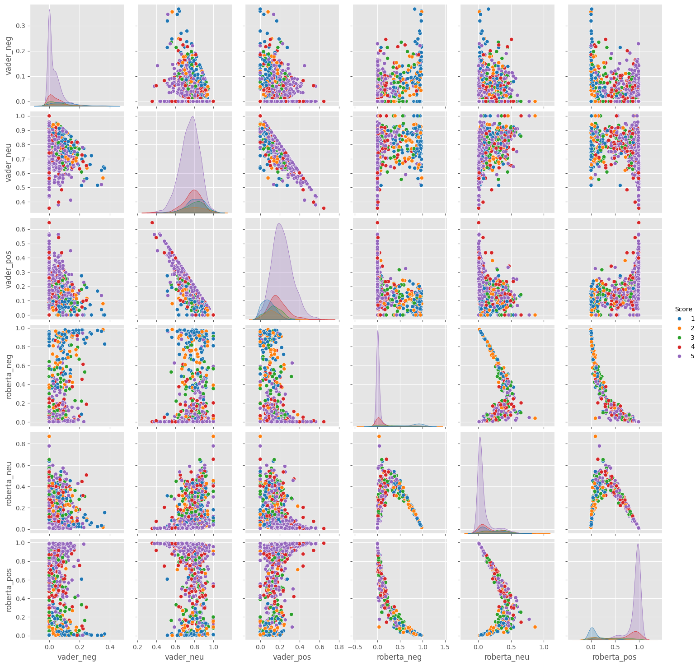

# Amazon Food Review Sentiment Analysis

## Overview
This project performs sentiment analysis on Amazon food review data to analyze and compare sentiment classification models.

## Data
The dataset consists of 1000 Amazon food reviews from the Amazon Reviews dataset. Each review has:

- Text: The review text
- Score: The 1-5 star rating
- ProductId, UserId, ProfileName: Metadata

## Analysis
The following models are used to classify sentiment:

1. **VADER (Valence Aware Dictionary and sEntiment Reasoner):** Rule-based model that relies on a sentiment lexicon. Scored using bag-of-words.
2. **Roberta:** Transformer model pretrained on social media data and fine-tuned for 3-class sentiment classification. Learns contextual relationships between words.

The models output positive, negative, and neutral scores between 0-1 for each review text. A comparison is done through visualizations of the score distributions and examining example predictions.

## Approach
1. Load data into Pandas dataframe
2. Preprocess text using NLTK tokenization, POS tagging, etc
3. Calculate VADER sentiment scores
4. Fine-tune Roberta model on data
5. Compile scores into a dataframe
6. Generate seaborn visualizations
7. Identify model differences on polarizing samples

## Contents
The Jupyter notebook covers:

- Importing data and libraries (Pandas, Matplotlib, NLTK, Transformers)
- Data exploration and preprocessing
- Calculating VADER sentiment scores
- Fine-tuning and scoring with Roberta transformer
- Compiling and visualizing results
- Model evaluation and examples

## Usage
To replicate the analysis:

1. Install Python dependencies
2. Download review dataset and update file path
3. Run Jupyter notebook cells end-to-end